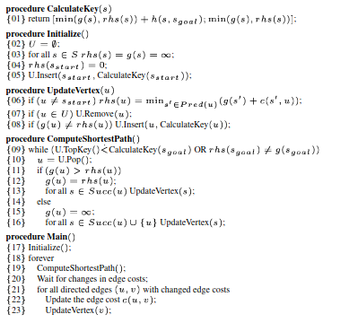
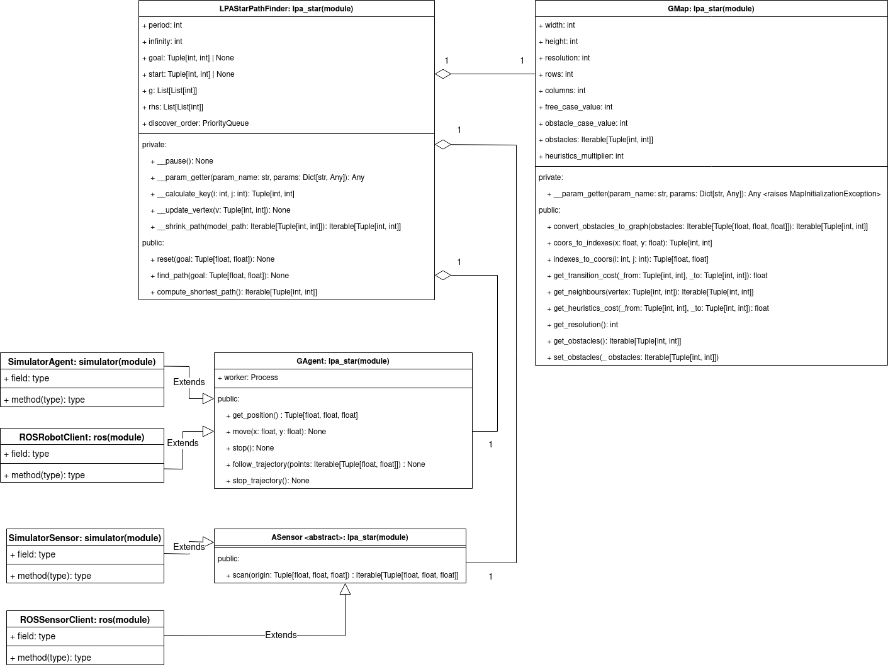

 # LPAStar - Path Finder (Universal Base Path Finder)
 
This repository contains a LPA* algorithm implementation. It also contains some abstractions and classes to inherit from if you want to customize you dynamic system behaviour. Check out python [documentation](https://sudogauss.github.io/LPAstar-PF/) and [examples](https://github.com/sudogauss/LPAstar-PF/tree/main/example). Below, you have the basic explanation of the algorithm and description of the project.

# What is LPA*?

LPA* is an algorithm which allows us to find the shortest path from $ s_{start} $ to $ s_{goal} $. It proceeds exactly as A*, but is adapted to the dynamic changes of the map in condition that the map is known at every instant of time.

The implementation of this algorithm is based on the [***Sven Koeing, Maxim Likhachev D\* Lite***](http://idm-lab.org/bib/abstracts/papers/aaai02b.pdf) paper. Here is a pseudocode and intuitive explanation of the algorithm:

## Pseudocode

---

## Algorithm Explanation

---

***Three functions:***
----------------------

LPA* uses 3 functions **g**, **rhs** and **h**. 

1. **g(s)** represents the minimal distance from $ s_{start} $ to $ s $. 
2. **rhs(s)** is a one-step lookup based on **g** values. $ rhs(s) =  min_{s' \in {Pred(s)}}[g(s') + c(s', s)] \ and \ rhs(s_{start}) = 0 $, where $ c(s', s) $ is a transition cost from $ s' $ to $ s $. **rhs** has more information and influences the expansion of the vertices.
3. **h(s, s')** is a heuristics. It is used by LPA* to expand only on vertices "which make sense" before expand on the other vertices if the obstacles are present on the way.

***Main routine:***
-------------------

***Main*** function initializes all variables that matter for path-finding. It assigns all ***g-values*** and ***rhs-values*** to infinity and then puts $ rhs(s_{start}) = 0 $. Then, while our agent (robot for example) does not reach the goal we compute the shortest path with current map configuration. We rescan the full map then and we update each vertex for which the edge cost has been changed.

***Update vertex***
-------------------

***UpdateVertex*** function recalculates the ***rhs-value*** of the vertex using the following formula: $ rhs(s) =  min_{s' \in {Pred(s)}}[g(s') + c(s', s)] $. Then it removes the vertex from priority queue and reinserts it if ***g-value*** of the vertex is not equal to its ***rhs-value*** (there is possible optimization).

***ComputeShortestPath***
-------------------------

## Architecture

---

This project allows you to implement your own path-finding agent (robot + sensor) by extending GRobot and ASensor classes. It also provides possibility to use it as a ROS node(**in developement**).

Here is the UML-diagram of the project that can help you in better understanding of the architecture:

