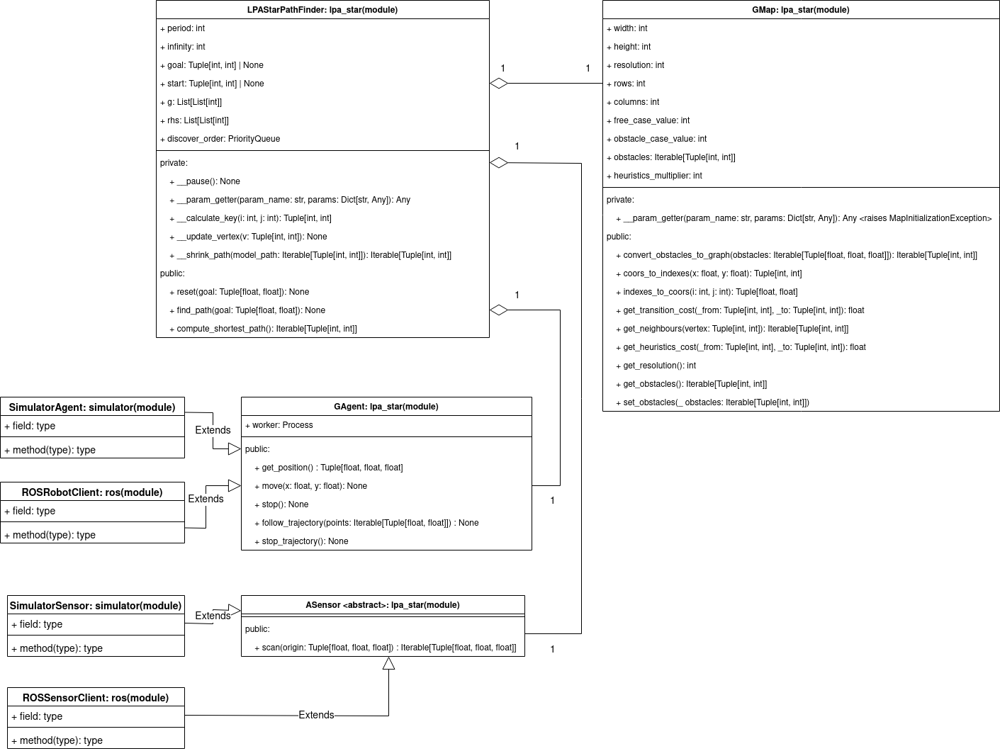

.. LPAstar-PF is a LPA* algorithm based path finder project. It provides you an implementation of
   the LPA* algorithm and an implementation of a map. It also provides GAgent and ASensor interfaces that
   can help you to implement full dynamic path finding system.

Welcome to LPAstar-PF's documentation!
======================================

.. toctree::
   :maxdepth: 2
   :caption: Contents:

Indices and tables
==================

* :ref:`genindex`
* :ref:`modindex`
* :ref:`search`

Project Architecture:

lpastar_pf package.
==================

.. automodule:: lpastar_pf.GAgent
   :members:
   :private-members:
   :special-members:

==================

.. automodule:: lpastar_pf.ASensor
   :members:
   :private-members:
   :special-members:

==================

.. automodule:: lpastar_pf.GMap
   :members:
   :private-members:
   :special-members:

==================

.. automodule:: lpastar_pf.LPAStarPathFinder
   :members:
   :private-members:
   :special-members:

ros package.
============

simulator package.
==================
